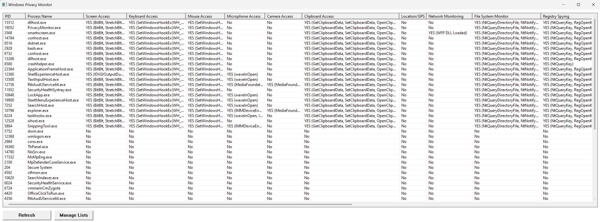

# 🔒 Windows Privacy Monitor


A comprehensive Windows application that monitors and detects which processes have access to sensitive system resources like screen capture, keyboard/mouse input, camera, microphone, and more.

## 🎯 Features

### Core Privacy Monitoring
- **Screen Capture Detection** - Detects GDI32, DXGI, D3D11, and Windows.Graphics.Capture APIs
- **Keyboard Access** - Monitors hooks (WH_KEYBOARD_LL), Raw Input, GetAsyncKeyState
- **Mouse Monitoring** - Tracks cursor position, hooks, and input simulation
- **Microphone Access** - Detects Core Audio, WinMM, DirectShow, WebRTC APIs
- **Camera Access** - Monitors MediaFoundation, DirectShow, VFW APIs
- **Clipboard Access** - Tracks clipboard read/write operations

### Advanced Detection
- **Location/GPS Access** - Windows Location API monitoring
- **Network Monitoring** - WinINet, Winsock, WFP (Firewalls), Packet Capture detection
- **File System Monitoring** - ReadDirectoryChanges, FileSystemWatcher detection
- **Registry Spying** - Registry enumeration and monitoring detection
- **Process Injection** - VirtualAllocEx, WriteProcessMemory, CreateRemoteThread detection
- **Bluetooth Access** - Bluetooth device enumeration monitoring
- **USB Monitoring** - USB device detection and enumeration

## 📸 Screenshots


*Main monitoring interface showing processes with detected privacy-sensitive APIs*


*Right-click menu for managing blacklist/whitelist*

## 🚀 Quick Start

### Prerequisites
- Windows 7 or later
- MinGW-w64 or Visual Studio (for compilation)

### Compilation

**Using GCC (MinGW):**
```bash
gcc -o privacy_monitor.exe src/main_program.c src/json.c -lpsapi -lcomctl32 -ladvapi32 -lshell32 -mwindows -O2
```

**Using Visual Studio:**
```bash
cl src/main_program.c src/json.c /link psapi.lib comctl32.lib advapi32.lib shell32.lib /SUBSYSTEM:WINDOWS
```

### Usage

1. Run `privacy_monitor.exe`
2. The application will automatically scan all running processes
3. Click column headers to sort by different criteria
4. Right-click on any process to:
   - Add to Blacklist (hide from view)
   - Add to Whitelist (show only whitelisted)
   - Open file location in Explorer
5. Click "Manage Lists" to edit Blacklist/Whitelist
6. Click "Refresh" to manually update the process list

## 📋 Detected APIs by Category

<details>
<summary><b>Screen Capture APIs</b></summary>

- `BitBlt`, `StretchBlt`, `GetDC`, `CreateCompatibleDC` (GDI32)
- `IDXGIOutputDuplication` (DXGI)
- `D3D11CaptureFrame` (Direct3D 11)
- `Windows.Graphics.Capture` (UWP)
- `DwmGetWindowAttribute` (Desktop Window Manager)
</details>

<details>
<summary><b>Keyboard Monitoring APIs</b></summary>

- `SetWindowsHookEx(WH_KEYBOARD_LL)` (Low-level hooks)
- `RegisterRawInputDevices`, `GetRawInputData` (Raw Input)
- `GetAsyncKeyState`, `GetKeyboardState`
- `PeekMessage(WM_KEYDOWN)`
</details>

<details>
<summary><b>Network Monitoring APIs</b></summary>

- `InternetOpen`, `HttpSendRequest` (WinINet)
- `WSAStartup`, `socket`, `connect` (Winsock)
- `GetExtendedTcpTable`, `GetExtendedUdpTable` (IP Helper - Sniffing)
- `FwpmEngineOpen0`, `FwpmFilterAdd0` (Windows Filtering Platform)
- `WinPcap/Npcap` (Packet Capture libraries)
</details>

<details>
<summary><b>Process Injection APIs</b></summary>

- `VirtualAllocEx`, `WriteProcessMemory`, `ReadProcessMemory`
- `CreateRemoteThread`, `NtQueueApcThread`, `NtCreateThreadEx`
- `EnumProcessModulesEx`
</details>

## 📝 License

This project is licensed under the MIT License - see the [LICENSE](LICENSE) file for details.

**Made with ❤️ for privacy-conscious users**
